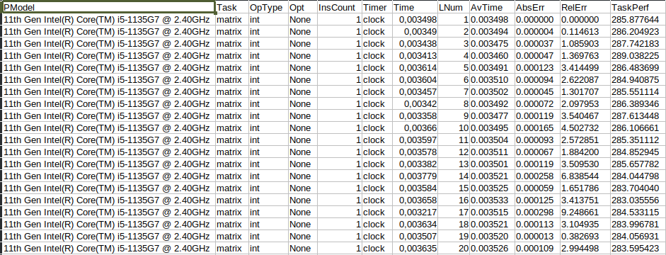
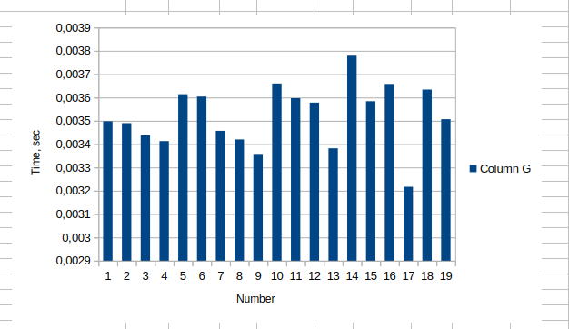

# Курс «Архитектура вычислительных систем». СибГУТИ. 2020 г.

## Лабораторная работа No 2

### Тема: Оценка производительности процессора.

### Задание: Реализовать программу для оценки производительности процессора ( benchmark).

1. Написать программу(ы) (benchmark) на языке С/С++/C# для оценки производительности процессора. В качестве набора типовых задач использовать либо минимум 3 функции выполняющих математические вычисления, либо одну функцию по работе с матрицами и векторами данных с несколькими типами данных. Можно использовать готовые функции из математической библиотеки (math.h) [3], библиотеки BLAS.
   Обеспечить возможность в качестве аргумента при вызовепрограммы указать общее число испытаний для каждой типовой задачи (минимум 10).
   Входные данные для типовой задачи сгенерировать случайным образом.

2. С помощью системного таймера (библиотека time.h, функции clock() или gettimeofday()) или с помощью процессорного регистра счетчика TSC реализовать оценку в секундах среднего времени испытания каждой типовой задачи. Оценить точность и погрешность (абсолютную и относительную) измерения времени (рассчитать дисперсию и среднеквадратическое
   отклонение).

3. Результаты испытаний в самой программе (или с помощью скрипта) сохранить в файл в
   формате CSV со следующей структурой:
   [PModel;Task;OpType;Opt;InsCount;Timer;Time;LNum;AvTime;AbsErr;RelErr;TaskPerf], где PModel – Processor Model, модель процессора, на котором проводятся испытания;
   Task – название выбранной типовой задачи (например, sin, log, saxpy, dgemv, sgemm и др.);
   OpType – Operand Type, тип операндов используемых при вычислениях типовой задачи;
   Opt – Optimisations, используемы ключи оптимизации (None, O1, O2 и др.);
   InsCount – Instruction Count, оценка числа инструкций при выполнении типовой задачи;
   Timer – название функции обращения к таймеру (для измерения времени);
   Time – время выполнения отдельного испытания;
   LNum – Launch Numer, номер испытания типовой задачи.
   AvTime – Average Time, среднее время выполнения типовой задачи из всех испытаний[секунды];
   AbsError – Absolute Error, абсолютная погрешность измерения времени в секундах;
   RelError – Relative Error, относительная погрешность измерения времени в %;
   TaskPerf – Task Performance, производительность (быстродействие) процессора при выполнении типовой задачи.

4. Построить сводную диаграмму производительности в зависимости от задач и выбранных исходных параметров испытаний. Оценить среднее быстродействие (производительность) для равновероятного использования типовых задач.

   

   ## Решение

1. Программа написана на языке C для оценки производительности процессора. В качестве типовой задачи была написана функция по умножению квадратных матриц.
   Входные данные из командой строки такие:
   Первое - название файла;
   Второе - размер квадратной матрицы;
   Третье - количество испытаний.

   

2. Измерение времени работы программы производилось с помощью библиотеки time.h и функции clock().

3. Результат программы сохранен в файл формата csv со следующей структурой: [PModel;Task;OpType;Opt;InsCount;Timer;Time;LNum;AvTime;AbsErr;RelErr;TaskPerf]

4. Построена диаграмма на основе данных из пункта 3

## Код

#include <math.h>
#include <stdio.h>
#include <stdlib.h>
#include <string.h>
#include <time.h>

char Pmodel[1000];
char Pmodel_new[1000] = "\0";
int LNum = 1;
int fcF = 0;
double avgTimee = 0.0;
double avgTimee_o = 0.0;
double absErr = 0.0;
double relErr = 0.0;
double taskPef = 0.0;

void intMatrix(int rep, int N);
void PModel();
void csvFile(double time_spent);
void outEnd();
void avgTime();
void absError(double time_spent);
void RelError(double time_spent);
void TaskPerf();

int main(int argc, char **argv) {
  if (argc < 3) {
    printf("Check!\n");
    return 0;
  }
  PModel();
  csvFile(1);
  char *c;
  int rep = strtol(argv[2], &c, 10);
  int N = strtol(argv[1], &c, 10);

  intMatrix(rep, N);
}

void intMatrix(int rep, int N) {
  for (int i = 0; i < rep; i++) {
    double time_spent = 0.0;
    fcF = 1;
    clock_t begin = clock();
    int **A = (int **)malloc(N * sizeof(int *));
    int **B = (int **)malloc(N * sizeof(int *));
    int **C = (int **)malloc(N * sizeof(int *));
    for (int i = 0; i < N; i++) {
      A[i] = (int *)malloc(N * sizeof(int));
      B[i] = (int *)malloc(N * sizeof(int));
      C[i] = (int *)malloc(N * sizeof(int));
    }
    srand(time(NULL));
    for (int i = 0; i < N; i++)
      for (int j = 0; j < N; j++) {
        A[i][j] = rand() % 100;
        B[i][j] = rand() % 100;
      }
    for (int i = 0; i < N; i++)
      for (int j = 0; j < N; j++) {
        C[i][j] = 0;
        for (int k = 0; k < N; k++) C[i][j] += A[i][k] * B[k][j];
      }
    for (int i = 0; i < N; i++) {
      free(A[i]);
      free(B[i]);
      free(C[i]);
    }
    free(A);
    free(B);
    free(C);
    clock_t end = clock();
    time_spent += (double)(end - begin) / CLOCKS_PER_SEC;
    printf("%f\n", time_spent);
    avgTimee += time_spent;
    // if (i == rep - 1) {
    //   fcF = 2;
    // }
    csvFile(time_spent);
  }
}

void csvFile(double time_spent) {
  FILE *file;
  file = fopen("csvFile.csv", "a");
  if (file == NULL) {
    printf("Error!\n");
    exit(0);
  }
  if (!fcF) {
    fprintf(file,
            "PModel;Task;OpType;Opt;InsCount;Timer;Time;LNum;AvTime;AbsErr;"
            "RelErr;TaskPerf\n");
  }
  // if (fcF == 2) {
  //   absError(time_spent);
  //   avgTime();
  //   fprintf(file, "%s;matrix;int;None;?InsCount?;clock;%f;%i;%f;%f\n",
  //   Pmodel,
  //           time_spent, LNum, avgTimee, absErr);
  // }
  if (fcF) {
    outEnd();
    avgTime();
    absError(time_spent);
    RelError(time_spent);
    TaskPerf();
    fprintf(file, "%s;matrix;int;None;1;clock;%f;%i;%f;%f;%f;%f\n", Pmodel,
            time_spent, LNum, avgTimee_o, absErr, relErr, taskPef);
    LNum++;
  }
  fclose(file);
}

void avgTime() { avgTimee_o = avgTimee / LNum; }

void absError(double time_spent) {
  absErr = fabs((avgTimee / LNum) - time_spent);
}

void RelError(double time_spent) { relErr = absErr * 100 / time_spent; }

void TaskPerf() { taskPef = 1 / avgTimee_o; }

void outEnd() {
  for (long unsigned int i = 0; i < strlen(Pmodel); i++) {
    if (Pmodel[i] == '\n') {
      Pmodel[i] = '\0';
      break;
    }
  }
}

void PModel() {
  FILE *uname;
  int lastchar;
  uname = popen(
      "lscpu | grep -E '^Имя модели|^Model name' | sed 's/Имя "
      "модели:*\\s*//;s/Model name:*\\s*//'",
      "r");
  lastchar = fread(Pmodel, 1, 1000, uname);
  Pmodel[lastchar] = '\0';
  printf("%s", Pmodel);
  pclose(uname);
}